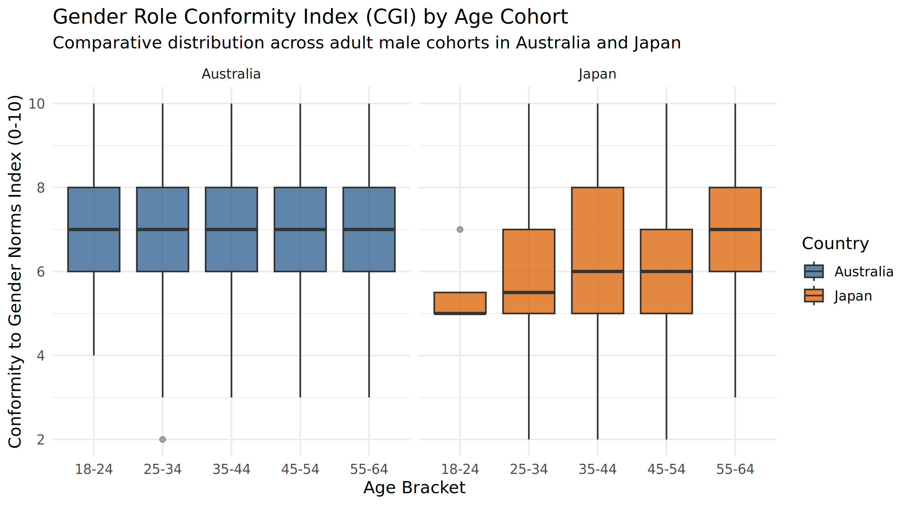

# Cross-National Comparative Statistical Analysis: Gender Role Conformity

A reproducible R data analytics pipeline examining generational variance in adherence to traditional masculine gender norms across Australia and Japan.

---

## Overview

This analysis investigates survey records from the **Global Masculinity Study**, measuring the **Conformity to Gender Norms Index (CGI)** across adult male cohorts in Australia ($N = 512$) and Japan ($N = 260$). 

The goal is to determine whether conformity to traditional masculine norms differs across generational brackets (18–24, 25–34, 35–44, 45–54, 55–64) and evaluates cross-national divergence between both cultures.

---

## Key Findings

- **Cross-National Baseline Differences:** Australian male respondents exhibited higher baseline conformity scores ($\mu = 7.10$, $\sigma = 1.55$) compared to Japanese respondents ($\mu = 6.50$, $\sigma = 1.79$). A two-way ANOVA confirmed this national main effect was statistically significant ($F(1, 762) = 25.99$, $p < 0.001$).
- **Generational Cohort Variance:** Non-parametric Kruskal-Wallis testing revealed significant generational divergence in Japan ($\chi^2(4) = 11.12$, $p = 0.025$), while Australian cohorts demonstrated consistent adherence levels across age brackets ($\chi^2(4) = 0.46$, $p = 0.977$).
- **Interaction Effects:** The two-way ANOVA showed no significant country-by-age interaction ($F(4, 762) = 1.80$, $p = 0.126$).

---

## Visualizations



---

## Repository Structure

```text
├── data/
│   └── global_masculinity_survey.csv   # Cleaned source dataset
├── output/
│   ├── figures/                        # Exported 300 DPI ggplot2 distributions
│   │   └── cgi_distribution_by_cohort.png
│   └── tables/                         # Exported ANOVA and summary CSV tables
│       ├── anova_test_results.csv
│       └── cohort_descriptive_statistics.csv
├── R/
│   └── analysis_pipeline.R             # End-to-end reproducible pipeline
├── .gitignore
└── README.md